# git add, commit으로 파일 기록해놓을 수 있음

```url
https://codingapple.com/course-status/
```

"git add, commit으로 파일 기록해놓을 수 있음"을 참조했습니다.

```bash
git add 파일명
git commit -m '아무메세지'
```

`git add (파일명)`은 git으로 추적할 파일을 올리는 명령입니다.
`git add .`으로 더 간소하게 모든 파일을 추적한다고 올리는 명령입니다.

`git commit -m "아무메시지"`

2단계로 구분한 이유는 기록이 필요한 것과 필요없는 것을 구분하기 위함입니다.
이미지는 특별하지 않은 경우 업데이트할 필요가 없습니다.

로컬 리포
커밋을 하기 전 영역입니다.

staging area는 git add추가 된 파일들이 있는 영역입니다.

원격 리포
git add로 추가되고 git commit으로 저장하는 영역입니다.

관련 도식화를 따로 구하겠습니다.

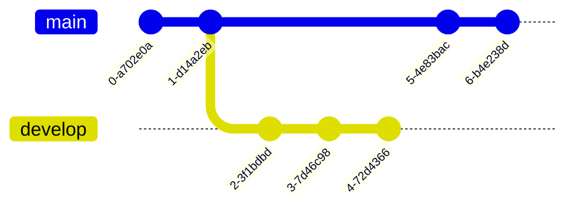

머메이드(mermaid)에서 이런 도식 유용해보입니다.

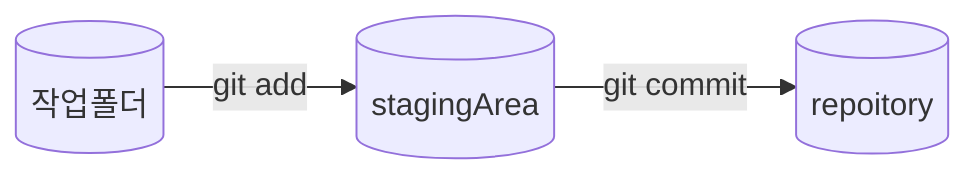

```bash
git status
```

중간에 git의 상태들을 확인 할 수 있는 명령입니다.

```bash
git log --all --online
```

커밋한 내역 확인하는 명령이다. `:q`로 iv를 나갈 수 있다.

```bash
git config --list
```

설정한 환경 확인하는 커맨드

# git add, commit, diff 쉽게 하는 법 (VSCode)

커밋은 하기 전후 확인하고 진행하는 것이 기본이다.

```bash
git diff
```

한계가 가 많다. 실제로 사용하지 않는다.

```bash
git difftool
```

vi 모드에서 확인할 수 있다.

git difftool도 직접활용할 일이 많지 않다. 에티터 플러그인을 활용하는 것으로 해결하도록 한다.

# git 에서 branch 만들기

기능을 추가하거나 중간분기에 복사본을 만들어야 할 때 branch를 만들 수 있다.
처음부터 추가하면 안정적이지 않을 수 있다.

```bash
git branch (브랜치이름)
```

새로운 브랜치를 만드는 방법이다.

```bash
git switch (브랜치이름)
```

브랜치로 전환하는 방법이다. 특정파일을 생성하거나 작성한 코드를 따로 저장하는 방법이다.
브랜치 이름 중에 `main` 혹은 `master`가 있다. 여기 브랜치가 중심이다.

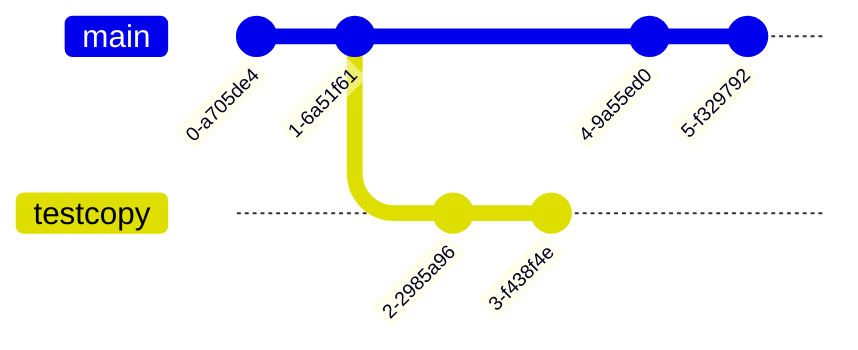

```JavaScript
const str = "잠깐 둘 텍스트";
```

```bash
git log --graph --oneline --all
```

HEAD는 현재 있는 브랜치이다.

브랜치를 합치는 명령은 `merge`이다. 각자 분업을 잘했으면 충돌이 없다. 하지만 같은 곳을 같이 수정했으면 `merge conflict`가 발생한다.
이런 경우 직접 무엇이 올바른지 수정하고 결정해야 한다.

VScode는 `merge`를 해결해주는 UI를 제공해준다.

```bash
git merge (브랜치이름)
```

# 다양한 merge 방법 (3-way, fast-forward, squash, rebase)

3-way merge는


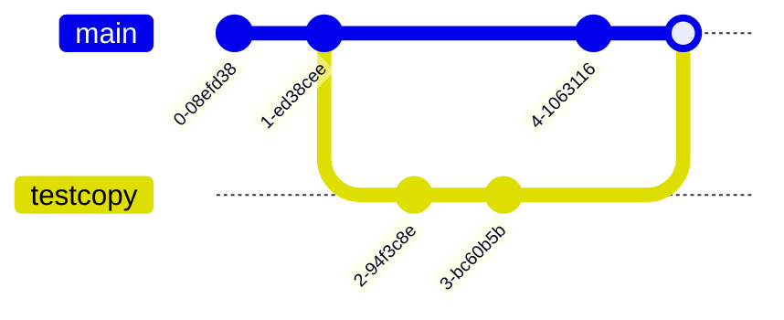

보통 처음 배우는 merge는 3way-merge이다. 2개의 브랜치를 1개의 커밋으로 합치는 방식이다.

fast-forward merge는 다른 브랜치를 만들었지만 원본에 새로운 커밋이 별로 없을 때 사용하는 방식이다.

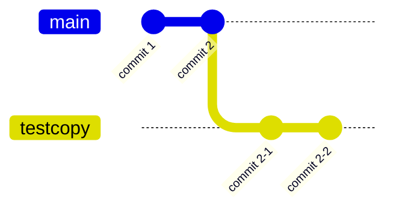

이랬던 깃로그를

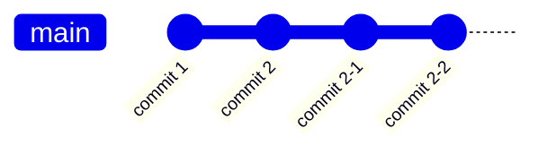

이렇게 바꿔준다.

```bash
git merge --no-ff (브랜치이름)
```

이 명령으로 할 수 있다.

하지만 main branch에 commit을 했으면 어떻게 해야 하는가? rebase하면 된다.

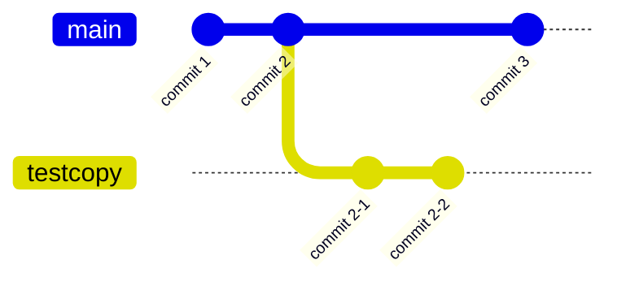

만약 상황이 이렇다면 commit 2의 브랜치를 commit 3으로 옮겨주고 `fast-forward`를 해주면 된다. 이런 이유로 `rebase`를 사용한다.

rebase를 사용하는 이유는 3-way merge를 너무 많이 하면 git history, git log를 깔끔하게 관리하기 위해서이다.

```bash
git switch testcopy
git rebase main
```

1. 브랜치로 이동
2. `git rebase main` 실행

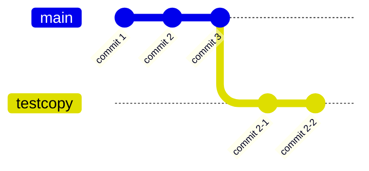

브랜치는 이렇게 바뀐다.

```bash
git switch main
git merge testcopy
```

3. main 브랜치로 돌아간다.
4. merge를 생한다.

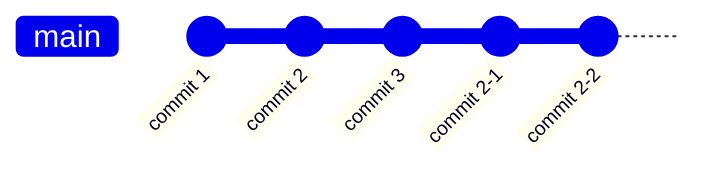

rebase의 단점은 충돌의 규모가 크다.

squash merge는 잔커밋을 무시한다.

```bash
git switch main
git merge --squash testcopy
git commit -m '메세지'
```


이랬던 git log를

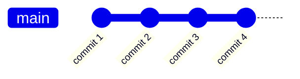

이렇게 바꿔준다.

브랜치를 삭제하려면 어떻게 해야하나?

```bash
git branch -d (브랜치이름)
```

merge가 된 브랜치는 `-d`로 삭제한다.

```bash
git branch -D (브랜치이름)
```

merge를 못한 브랜치는 `-D`로 삭제한다.

회사 혹은 협업하는 사이드 프로젝트를 경험하면서 merge가이드를 기준으로 결정하면 된다.

# 코드짜다가 실수했다 되돌아가자 (git revert, reset, restore)

생각보다 많이 사용하는 기능이 아니다. 그래서 필요할 때 검색해도 된다.

```bash
git log --graph --oneline --all
```

`752a269 (HEAD -> main, forRebase) for rebase` 이런 코드를 돌려주면 가장 왼쪽이 id에 해당한다.  
id를 활용해서 commit했던 시점으로 돌아간다.

```bash
git restore (파일이름)
```

파일을 최근 커밋으로 되돌리는 명령이다.

```bash
git restore --source 커밋아이디 파일명
```

```bash
git restore --staged 파일명
```

git staging에서 빼는 방법이다. 외울 필요없는 명령이다.

```bash
git revert (커밋아이디)
```

커밋에서 작업한 내역을 삭제할 수 있다.

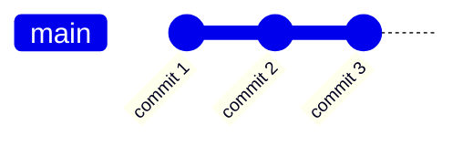

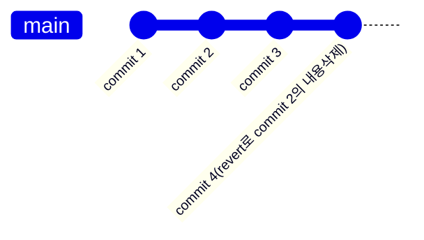

```bash
git reset --hard (커밋아이디)
```


`git reset --hard commit 2`로 명령하면 아래처럼 됩니다.

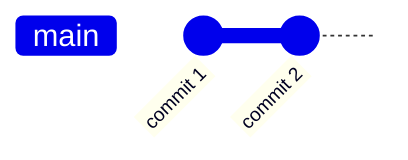

커밋 아이디 시점으로 돌아갈 수 있다. 자주 사용하는 명령이 아니다. 위험한 명령이다.

가능하면 변경사항이 많지 않았을 때 사용해도 된다.

# Github 사용법 1. 내 코드 올릴 땐 git push

git push, git pull
git은 버전관리 소프트웨어이다.
리포지토리는 작업한 파일과 폴더를 저장한 곳이다. .git 숨김파일이 있다.

원격 리포를 만드는 이유는 컴퓨터가 고장나도 다른 컴퓨터로 다시 받을 수 있다. 즉 온라인에 백업할 수 있는 것이다.

`git init`은 리포를 만드는 명령이다.

```bash
git branch -M main
```

맥은 이런 명령필요 없다.

1. `git add .`
2. `git commit -m "커밋 메시지"`
3. `git push (원격 리포 이름)`

원격 리포로 보낼 수 있다. 처음만 이렇게 명령하고 나중에는 `git push`만 입력하면 된다.

```bash
git remote add origin (원격 리포 이름)
```

```bash
git push
```

```bash
git clone (복사할 원격리포)
```

.gitignore파일을 명시하고 git이 더이상 추적안하게 만들 수 있다.
개발하면서 git이 모든 파일을 추적할 필요는 없기 때문이다. 예를 들어, node_modules안에 있는 것은 추적할 필요가 없다.

# Github 사용법 2. 타인과 협업하기 (git clone, pull)

원격저장소를 사용하면 협업이 가능하다. git push만 잘하면 된다.

```bash
git clone (복사할 원격리포)
```

원하는 폴더에 코드를 가져오는 방법이다.

원격과 로컬 사이 소스코드가 다르면 `git push` 명령을 거부한다. 그래서 `git pull`을 먼저하고 그 다음에 `git push`를 하면 된다.

`git pull`은 `git fetch`랑 `git merge`를 같이 명령한 것이랑 같다.

`git pull` = `git fetch` + `git merge`

작업하는 원격 리포(깃헙)에서 setting > collaborators에 협업하는 사람 아이디 등록하는 것도 잊지말자.

```bash
git pull
```

```bash
git pull (브랜치 이름)
```

브랜치를 가져오는 명령이다.

# Github 사용법 3. 브랜치로 협업하기 (pull request)

개발자만 100명이 넘을 때는 pull, push만 하면 재앙이 발생할 수 있다.

pull -> branch -> push (브랜치 이름) -> merge 순서로 작업한다.

```bash
git pull
```

가끔은 브랜치를 변경하고 `git pull` 명령을 해야 하는 경우도 있습니다. 로컬과 원격 브랜치의 커밋차이 때문입니다. 그래서 `git pull` 전에 `git switch`로 브랜치를 바꾸도록 합니다.

`git pull`하기 전에 원격리포만 미리 확인하고 싶으면 `git checkout origin/(브랜치이름)`으로 명령하는 방법과 `git fetch`가 있습니다.

```bash
git branch (브랜치 이름)
```

브랜치를 새로 만드는 명령입니다. 그래서 이미 만들었으면 하지 않습니다.

```bash
git switch (브랜치 이름)
```

```bash
git add .
```

```bash
git commit -m "브랜치에서 날리는 커밋 메시지"
```

```bash
git push (원격 리포 이름) (로컬 리포 브랜치 이름)
```

VScode 상에서는 여기까지이다.  
이제 CTO, 개발 파트별 리드, 시니어 엔지니어들이 코드 리뷰를 진행한다.  
코드 리뷰랑 코멘트는 깃헙 사이트에서 진행한다.

깃헙에서 원격리포 주소 > Pull request에서 확인하면 된다.

# git flow / trunk-based 브랜치 전략

git을 깔끔하게 관리하는 방법들이 있다. git flow, github flow, gitlab flow, trunk-based 등 다양하다.

git flow 전략

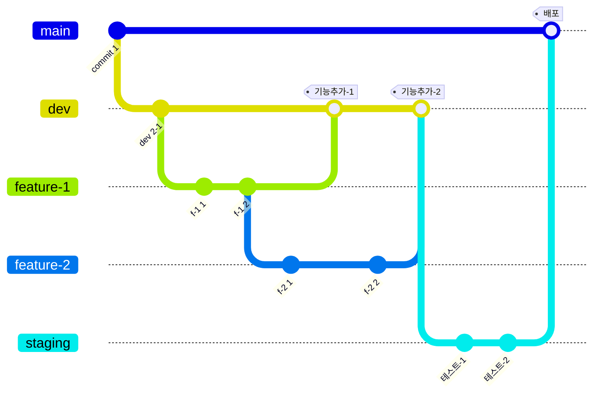

기능을 어느시점에 추가하는 방식에 좋다.
dev 브랜치를 따로 만든다. `dev` 브랜치에서 기능 및 이름으로 브랜치를 또 만든다.
`staging`, `test`, `beta`, `release`에서 테스트하고 괜찮으면 merge한다. 테스트하고 배포중에 발견한 버그는 hotfix 브랜치를 만들고 해결한다.

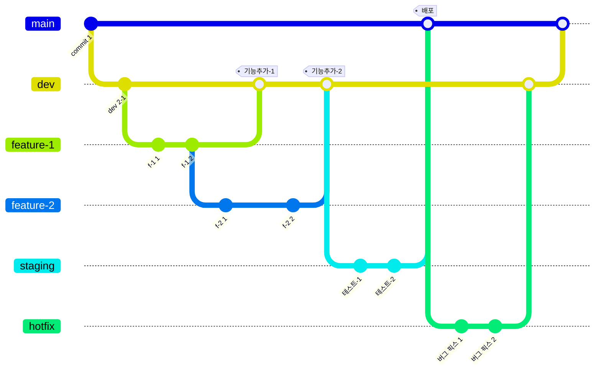

단점은 CI/CD에서는 부적합하다. 즉 유연하고 빠르게 기능추가하기 어렵다.

Trunk-based 전략

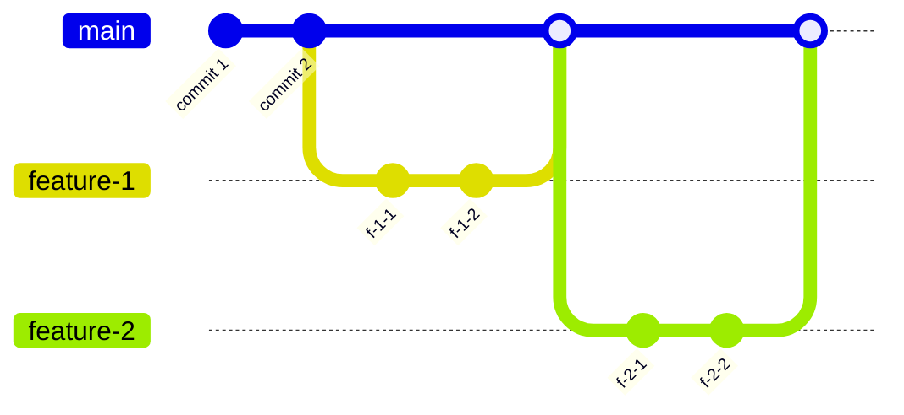

trunk-based, github flow같은 전략도 있다. 하나의 main 브랜치를 중심으로 필요할 때 몇개의 브랜치만 따로 두고 merge한다.
테스트, 배포같은 DevOps 엔지니어 혹은 인프라가 있어야 가능하다. 또 코드가 유지보수하기 좋게 안정적이어야 한다.
코드리뷰도 많이 진행해야 한다.

# git stash로 코드 잠깐 보관하기

코드를 잠깐 보관해야하는 상황은 은근히 많이 있다. 처음에 일단 돌아가게만 코드를 작성하는 사람들도 있다. 이런 코드들은 보통 코드퀄리티가 떨어진다.
하지만 떨어저도 잠깐작성하고 테스트는 해봐야 한다.

```bash
git stash
```

이렇게 하면 최근 커밋으로 돌아온다.
이 명령을 하면 임시로 보관해준다. 브랜치도 아니라서 협업하면서 브랜치 더러워지는 일도 없다. 주석처리도 아니라서 코드베이스가 더러워지는 것도 아니다.

```bash
git stash save "stash 메시지"
```

이렇게 하면 stash에 메모를 남길 수 있다.

```bash
git stash list
```

이명령은 지금까지 stash한 목록을 확인할 수 있다.

```bash
git stash pop
```

이 명령만 봐도 자료구조랑 알고리즘은 일상이라는 것을 알 수 있다.
가장 최근의 stash를 가져온다.

```bash
git stash drop (삭제할 id)
```

stash에서 어느 것을 삭제하는 기능이다.

```bash
git stash clear
```

stash를 비우는 명령이다.

```bash
git stash -p
```

무엇을 stash할지 선택지를 알려주는 명령이다.
