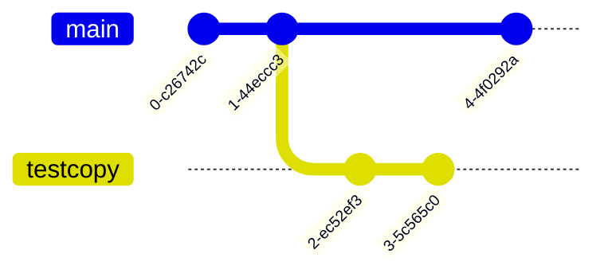
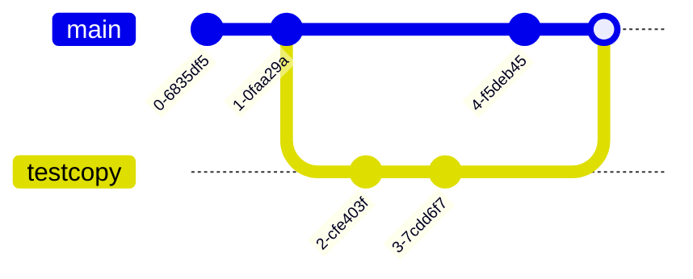

# git add, commit으로 파일 기록해놓을 수 있음

```url
https://codingapple.com/course-status/
```
"git add, commit으로 파일 기록해놓을 수 있음"을 참조했습니다.


```bash
git add 파일명
git commit -m '아무메세지'
```

`git add (파일명)`은 git으로 추적할 파일을 올리는 명령입니다.
`git add .`으로 더 간소하게 모든 파일을 추적한다고 올리는 명령입니다.

`git commit -m "아무메시지"`

2단계로 구분한 이유는 기록이 필요한 것과 필요없는 것을 구분하기 위함입니다.
이미지는 특별하지 않은 경우 업데이트할 필요가 없습니다.

로컬 리포
커밋을 하기 전 영역입니다.


staging area는 git add추가 된 파일들이 있는 영역입니다.

원격 리포
git add로 추가되고 git commit으로 저장하는 영역입니다.

관련 도식화를 따로 구하겠습니다.


머메이드(mermaid)에서 이런 도식 유용해보입니다.


```bash
git status
```

중간에 git의 상태들을 확인 할 수 있는 명령입니다.

```bash
git log --all --online
```

커밋한 내역 확인하기


```bash
git config --list
```

설정한 환경 확인하는 커맨드


# git add, commit, diff 쉽게 하는 법 (VSCode)

커밋은 하기 전후 확인하고 진행하는 것이 기본이다.

```bash
git diff
```
한계가 가 많다. 실제로 사용하지 않는다.

```bash
git difftool
```
vi 모드에서 확인할 수 있다.

git difftool도 직접활용할 일이 많지 않다. 에티터 플러그인을 활용하는 것으로 해결하도록 한다.


# git 에서 branch 만들기

기능을 추가하거나 중간분기에 복사본을 만들어야 할 때 branch를 만들 수 있다.
처음부터 추가하면 안정적이지 않을 수 있다.

```bash
git branch (브랜치이름)
```

새로운 브랜치를 만드는 방법이다.

```bash
git switch (브랜치이름)
```
브랜치로 전환하는 방법이다. 특정파일을 생성하거나 작성한 코드를 따로 저장하는 방법이다.
브랜치 이름 중에 `main` 혹은 `master`가 있다. 여기 브랜치가 중심이다.


```JavaScript
const str = "잠깐 둘 텍스트";
```

```bash
git log --graph --oneline --all
```
HEAD는 현재 있는 브랜치이다.

브랜치를 합치는 명령은 `merge`이다. 각자 분업을 잘했으면 충돌이 없다. 하지만 같은 곳을 같이 수정했으면 `merge conflict`가 발생한다.
이런 경우 직접 무엇이 올바른지 수정하고 결정해야 한다.

VScode는 `merge`를 해결해주는 UI를 제공해준다.

```bash
git merge (브랜치이름)
```

# 다양한 merge 방법 (3-way, fast-forward, squash, rebase)

3-way merge는 





보통 처음 배우는 merge는 3way-merge이다. 2개의 브랜치를 1개의 커밋으로 합치는 방식이다.

fast-forward merge는 다른 브랜치를 만들었지만 원본에 새로운 커밋이 별로 없을 때 사용하는 방식이다.


이랬던 깃로그를


이렇게 바꿔준다.

```bash
git merge --no-ff (브랜치이름)
```

이 명령으로 할 수 있다.

하지만 main branch에 commit을 했으면 어떻게 해야 하는가? rebase하면 된다.


만약 상황이 이렇다면 commit 2의 브랜치를 commit 3으로 옮겨주고 `fast-forward`를 해주면 된다. 이런 이유로 `rebase`를 사용한다.

rebase를 사용하는 이유는 3-way merge를 너무 많이 하면 git history, git log를 깔끔하게 관리하기 위해서이다.

```bash
git switch testcopy
git rebase main
```
1. 브랜치로 이동
2. `git rebase main` 실행


브랜치는 이렇게 바뀐다.

```bash
git switch main
git merge testcopy
```
3. main 브랜치로 돌아간다.
4. merge를 생한다.


rebase의 단점은 충돌의 규모가 크다.


squash merge는 잔커밋을 무시한다.

```bash
git switch main
git merge --squash testcopy
git commit -m '메세지'
```


이랬던 git log를


이렇게 바꿔준다.

브랜치를 삭제하려면 어떻게 해야하나?

```bash
git branch -d (브랜치이름)
```
merge가 된 브랜치는 `-d`로 삭제한다.

```bash
git branch -D (브랜치이름)
```
merge를 못한 브랜치는 `-D`로 삭제한다.

회사 혹은 협업하는 사이드 프로젝트를 경험하면서 merge가이드를 기준으로 결정하면 된다.


리베이스를 위해 작성하는 글