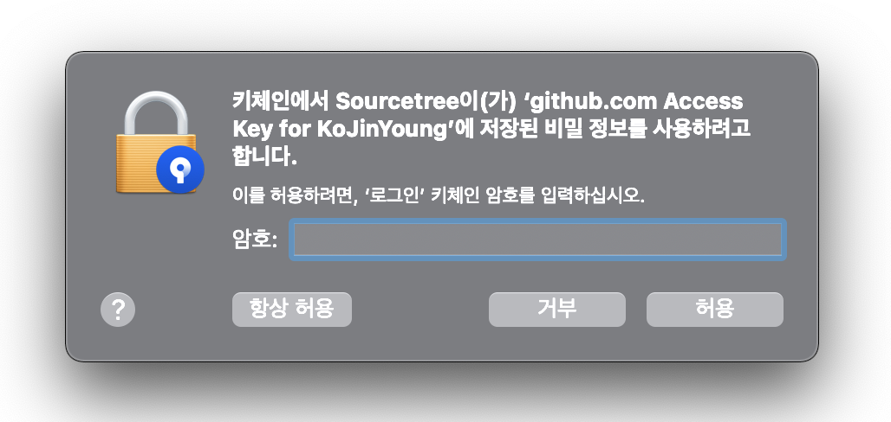

# 3주차

PR, commit 되돌리기 - amend, revert, reset , 작업내역 임시 저장 - stash
commit 메시지 컨벤션, gitignore, README
github exprore , 오픈소스(open source)
github profile , repo 소개 , github page

# Pull Request

PR은 merge 요청입니다. 코드를 리뷰하고 검토하면서 코드 개선을 하는 과정입니다. 프로젝트 품질, 코드 품질을 관리할 수 있습니다. 큰 merge는 PR을 거칩니다.

PR은 GitHub 웹에서 처리하기를 권장합니다.

PR은 브랜치 단위입니다. PR를 생성한 상태에서 `commit`하고 push하면 원격의 PR은 살아있고 추가 `commit`까지 반영됩니다.

원격에서 작업이 끝나면 웹에서 브랜치를 삭제하는게 편합니다.

PR은 리뷰를 포함합니다. 보통 수정요청이 받드시 들어옵니다. 수정 전에 브랜치를 삭제하면 당연히 곤란합니다.

다른 사람이 소유하고 있는 원격 리포를 복사할 때는 fork부터 해야 합니다.

# commit 고치기

## amend

중간에 커밋 실수 하는 사람은 은근히 많습니다. 개별 커밋으로 하기에는 조금 부족하고 수정은 필요할 때가 있습니다. 예를 들어 주석에 오타를 낸 것 같은 경우입니다.

커밋을 되돌릴 때는 본인 혼자 작업하는 브랜치에서만 되돌립니다. 만약에 브랜치가 많이 갈리거나 merge하는 commit에서 되돌리면 큰일 날 수 있습니다.

최신 커밋 고치는 명령은 amend입니다. 다른 커밋은 못 고칩니다.

push 이전에 amend를 할 때는 비교적 간단합니다. 하지만 원격에서 강제 push할 때는 정말 위험합니다. 다른 브랜치에 영향을 주지않는 본인 브랜치에서만 합니다.

강제 push를 하고 수정하는 것도 가능합니다. 하지만 설정을 `git allow force push`로 해야합니다. 하지만 어떤 참사가 발생할지 모르니 주의하도록 합니다.

## revert, reset

최신이 아닌 커밋을 되돌리는 방법도 존재합니다. revert은 commit 기록을 남기고 되돌립니다.

reset은 기록을 되돌립니다. reset 기준 앞의 commit은 모두 삭제됩니다. 기준 커밋상태로 돌아가기 때문에 잘못하면 심각한 문제를 만들 수 있습니다.

## Stash

Stash는 임시보관함입니다. 작업하던 내용을 임시로 보관할 때 사용합니다. 버그가 발생하면 추가기능를 만들어서 고치는 것을 보고 hotfix라고 부릅니다.

커밋하기 전에 다른 브랜치 이동이 필요할 때 유용합니다. 그래서 커밋이 아닌 상태일 때 명령이 가능합니다.

적용해도 되고 삭제해도 됩니다.

완전히 새로운 파일은 추적하지 않습니다. git add을 안했기 때문에 덮어지거나 stash로 보호할 필요가 없습니다. 파일이 add된적이 없으면 브랜치로 할당받은 적도 없기 때문에 branch 변경을 해도 파일이 영향을 받지 않습니다.

git stash는 변경사항을 담아두도록 합니다. 하지만 남용하면 작업을 잊어버릴 수 있습니다.

# 협업

## 커밋 컨벤션

커밋 메시지 컨벤션은 회사마다 조직마다 다릅니다. 커밋 메시지를 대충 작성하면 작업을 오랜 기간 놔버리면 모릅니다.

[좋은 git 커밋 메시지를 작성하기 위한 7가지 약속](https://meetup.toast.com/posts/106)

제목과 본문 1줄 띄웁니다.

한글과 영어는 조금 다릅니다.

본문은 무엇을 왜에 맞추어서 작성합니다.

커밋 메시지도 중요하지만 커밋 단위도 중요합니다. 당연히 사람과 조직마다 다릅니다. 중요한 것은 관된 규칙입니다. 새로운 변경이 버그를 발생시키면 이전 커밋까지 차이가 작으면 수정이 편하다는 것을 알 수 있습니다.

단위가 기능, 이슈, 함수 등 다양한 기준이 될 수 있습니다.

동사를 영어로 작성하고 나머지를 한글로 작성하는 것도 전략입니다. 글로벌 오픈소스가 아니면 한국어로 작성해도 괜찮습니다.

많은 회사들은 영어로 커밋메시지를 작성합니다.

커밋 메시지 템플릿도 활용하는 것이 전략입니다.

```txt
키워드 - 기능, 단위 #issue번호

변경사항 :

# 키워드: 생성, 수정, 추가,고치기,문서화,스타일, 테스트
# "왜", "무엇"을 포함하기
# 제목은 80자 이내로, 긴 내용은 줄바꿈하고 본문에서
```

이슈 번호는 PR할 예정이면 생략해도 괜찮습니다. 하지만 아니면 붙이도록 합니다.

## 코드리뷰

코드리뷰는 사람이 작업한 코드를 리뷰하는 작업입니다. 어떤 개선을 요구합니다. 보통은 기능, 버그, 성능을 중점으로 봅니다.

리뷰가 완료되면 merge하게 됩니다.

코드리뷰를 하는 이유는 첫번째는 코드 품질을 높일 수 있습니다. 본인한테 안 보이는 버그를 다른 사람이 볼 수 있습니다. 배포 전에 작은 버그들 쉽게 찾을 수 있습니다. 피드백을 주면서 더 좋은 해결책도 찾을 수 있습니다. 실력측면에서 상당히 좋습니다.

기술 블로그에서 코드 리뷰에 대해서 올려 놓는 경우가 많습니다.

코드리뷰는 받는 사람도 주는 사람도 모두 도움됩니다.

# gitignore

gitignore는 git이 추적하지 않게 만드는 파일입니다. .gitignore으로 만들면 됩니다. 안에 텍스트파일처럼 입력하면 git은 알아서 무시합니다.

github에 올리면 큰일나는 것들이 있습니다. api key, 비밀번호, 컴퓨터 설정 등이 있습니다. 파이썬 가상환경, 자바 바이트코드 모두 각각 다를 때가 있습니다. 이런 파일들은 안보이게 관리하는 것을 권장합니다.

# README.md

보통 소프트웨어를 설치하면 바로 봐야 하는 것은 `README.md`파일입니다.

# github 커뮤니티

프로그래밍은 좋은 것을 많이보고 적용하려고 시도할수록 실력이 빠르게 키울 수 있습니다.

http://rankedin.kr/users

오픈 소스의 좋아요 개수 랭킹을 보여줍니다.

git blame은 남탓을 프로페셔널하게 할 수 있는 기능입니다.

https://github.com/explore에서 트랜드를 확인하기를 권장합니다.

https://github.com/collections/learn-to-code은 주제별로 묶어놓습니다.

## 오픈소스

오픈소스에 기여하면 엄청나게 프레임워크 혹은 라이브러리가 확장할 수 있습니다.

오픈소스는 무조건 무료가 아닙니다. 하지만 라이센스를 지켜줘야 합니다. 프로젝트의 라이센스에 따라 적용이 달라집니다. 라이센스를 이해하고 사용하는 것이 중요합니다.

[라이선스 비교표](https://www.olis.or.kr/license/compareGuide.do)

버그 리포트도 기여입니다. 오타수정도 기여입니다. 28%의 기여가 오타 서식 수정입니다. 번역도 컨트리뷰터가 되는 전략입니다.

권장 도서입니다. [성당과 시장 : 우연한 혁명으로 일어난 리눅스와 오픈소스에 대한 생각](https://www.hanbit.co.kr/store/books/look.php?p_code=E8095481781)

알아두기를 권장하는 행사입니다. [HACKTOBERFEST](https://hacktoberfest.com/)

# 에러노트



- 원인:
  1.  로컬 리포를 원격 리포로 푸시할 때 발생했습니다.
  2.  맥북에서 보안문제로 돌려준 피드백입니다.
  3.  간단하게 노트북 비번치라고 할 수 있는 것을 다른 정보를 제공하는 것으로 더 어려운 절차를 거처야 할 것 처럼보였습니다. 나쁜 다이얼로그 UX입니다.
  4.  검색도 좋지 않았습니다. [[Sourcetree] git-credential-osxkeychain](https://unttd.cc/zilla/17)

그냥 노트북 비번치라고 말해줄 것이지 꼭 깃헙 계정들어가 키체인 다시 발급받야하게 생겼습니다.

- 해결:
  1.  노트북 비번을 치고 해결했습니다.
